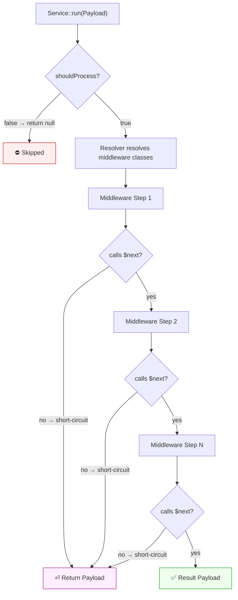

# Service Runner

A middleware pipeline runner for PHP application services. Compose use cases from ordered steps over an immutable payload, following the Pipeline pattern and Command Bus design.

**Framework-agnostic** at its core, with first-class integration for **Laravel 11/12/13** and **CakePHP 5**.

## Requirements

- PHP 8.4+
- Docker (for running tests and sample apps)
- PSR-11 Container (optional, for dependency injection)

## Installation

```bash
composer require sjonatas/service-runner
```

## Core Concepts

### PayloadData (DTO)

Input data for a service is defined as a readonly DTO implementing the `PayloadData` marker interface. Public properties are extracted automatically -- no boilerplate needed.

```php
use ServiceRunner\Middleware\PayloadData;

readonly class CreateUserData implements PayloadData
{
    public function __construct(
        public string $name,
        public string $email,
    ) {}
}
```

### Payload

An immutable data carrier that flows through the middleware pipeline. It is constructed from a `PayloadData` DTO.

```php
use ServiceRunner\Middleware\ServicePayload;

$payload = new ServicePayload(new CreateUserData(
    name: 'John Doe',
    email: 'john@example.com',
));

// Read attributes
$payload->getAttribute('name');               // "John Doe"
$payload->getAttribute('role', 'guest');       // "guest" (default)
$payload->getAttributes();                    // full array

// Immutable transformations (returns a new instance)
$payload = $payload->withAttribute('status', 'active');
$payload = $payload->withAttributes(['name' => 'Jane']);
$payload = $payload->withoutAttribute('email');
$payload = $payload->mergeAttribute('tags', ['admin', 'editor']);
```

You can also implement the `Payload` interface to create your own payload class.

### Middleware

A single step in the pipeline. Each middleware receives the payload and a `$next` callable to continue the chain.

```php
use ServiceRunner\Middleware\Middleware;
use ServiceRunner\Middleware\Payload;

class ValidateEmail implements Middleware
{
    public function __invoke(Payload $payload, callable $next): Payload
    {
        $email = $payload->getAttribute('email');

        if (! filter_var($email, FILTER_VALIDATE_EMAIL)) {
            return $payload->withAttribute('error', 'Invalid email');
        }

        return $next($payload);
    }
}
```

A middleware can:

- **Transform the payload** before passing it forward
- **Short-circuit** the pipeline by returning without calling `$next`
- **Post-process** the result by acting on the payload returned from `$next`

```php
class LogExecution implements Middleware
{
    public function __invoke(Payload $payload, callable $next): Payload
    {
        // Before
        logger()->info('Starting pipeline');

        // Forward
        $result = $next($payload);

        // After
        logger()->info('Pipeline completed', $result->getAttributes());

        return $result;
    }
}
```

### Service

An abstract class that represents a use case. It holds configuration options and a middleware pipeline, and exposes a `run()` method to execute them.

```php
use ServiceRunner\Service;
use ServiceRunner\Middleware\Payload;

class CreateUser extends Service
{
    // Optionally override to conditionally skip execution
    public function shouldProcess(Payload $payload): bool
    {
        return $payload->getAttribute('email') !== null;
    }
}
```

Services receive `$options` (an array of configuration) and a `MiddlewareRunner` (the pipeline) via the constructor. When `run()` is called, it merges service-level options with any options already on the payload, checks `shouldProcess()`, and invokes the pipeline.

### ServiceConfig

An interface you implement to define your services and their middleware pipelines. This is where you wire everything together.

```php
use ServiceRunner\ServiceConfig;

class AppServiceConfig implements ServiceConfig
{
    public function services(): array
    {
        return [
            CreateUser::class => [
                'middlewares' => [
                    ValidateEmail::class,
                    HashPassword::class,
                    PersistUser::class,
                    SendWelcomeEmail::class,
                ],
                'options' => [
                    'notify' => true,
                ],
            ],
            UpdateUser::class => [
                'middlewares' => [
                    ValidateEmail::class,
                    PersistUser::class,
                ],
                'options' => [],
            ],
        ];
    }
}
```

### Middleware Resolution

Two resolvers are provided to convert class names into middleware instances:

| Resolver | When to use |
|---|---|
| `BasicResolver` | Vanilla PHP without a DI container. Instantiates middleware with `new $entry()`. Works for stateless middleware with no constructor dependencies. |
| `Resolver` | Any PSR-11 container (Laravel, CakePHP, PHP-DI, League, Symfony, etc.). Resolves middleware via `$container->get($entry)`, supporting full dependency injection. |

## Usage

### Vanilla PHP (no framework)

#### Without dependency injection

```php
use ServiceRunner\Middleware\BasicResolver;
use ServiceRunner\Middleware\Runner;
use ServiceRunner\Middleware\ServicePayload;

$resolver = new BasicResolver();
$runner = new Runner([
    ValidateEmail::class,
    HashPassword::class,
    PersistUser::class,
], $resolver);

$service = new CreateUser([], $runner);

$result = $service->run(new ServicePayload(new CreateUserData(
    name: 'John Doe',
    email: 'john@example.com',
)));
```

#### With a PSR-11 container (e.g. PHP-DI)

```php
use DI\ContainerBuilder;
use ServiceRunner\Middleware\Resolver;
use ServiceRunner\Middleware\Runner;
use ServiceRunner\Middleware\ServicePayload;

$container = (new ContainerBuilder())->build();
$resolver = new Resolver($container);

$runner = new Runner([
    ValidateEmail::class,
    HashPassword::class,
    PersistUser::class,
], $resolver);

$service = new CreateUser([], $runner);

$result = $service->run(new ServicePayload(new CreateUserData(
    name: 'John Doe',
    email: 'john@example.com',
)));
```

#### Using ServiceConfig to centralize definitions

```php
use ServiceRunner\Middleware\BasicResolver;
use ServiceRunner\Middleware\Runner;
use ServiceRunner\Middleware\ServicePayload;

$config = new AppServiceConfig();
$resolver = new BasicResolver();

foreach ($config->services() as $serviceClass => $definition) {
    $runner = new Runner($definition['middlewares'], $resolver);
    $service = new $serviceClass($definition['options'], $runner);

    // Register in your app however you prefer
}
```

### Laravel (11 / 12 / 13)

The package auto-discovers its service provider via Composer -- no manual registration needed.

**1. Create your ServiceConfig implementation:**

```php
// app/Services/AppServiceConfig.php
namespace App\Services;

use ServiceRunner\ServiceConfig;

class AppServiceConfig implements ServiceConfig
{
    public function services(): array
    {
        return [
            \App\Services\CreateUser::class => [
                'middlewares' => [
                    \App\Middleware\ValidateEmail::class,
                    \App\Middleware\HashPassword::class,
                    \App\Middleware\PersistUser::class,
                ],
                'options' => ['notify' => true],
            ],
        ];
    }
}
```

**2. Bind it in a service provider:**

```php
// app/Providers/AppServiceProvider.php
use App\Services\AppServiceConfig;
use ServiceRunner\ServiceConfig;

public function register(): void
{
    $this->app->bind(ServiceConfig::class, AppServiceConfig::class);
}
```

**3. Resolve and run services from the container:**

```php
use App\Services\CreateUser;
use ServiceRunner\Middleware\ServicePayload;

$service = app(CreateUser::class);

$result = $service->run(new ServicePayload(new CreateUserData(
    name: 'John Doe',
    email: 'john@example.com',
)));
```

The provider automatically:
- Registers `Resolver` as a singleton backed by Laravel's container
- Aliases `MiddlewareResolver` to the concrete `Resolver`
- Reads your `ServiceConfig` and binds each service to the container with its pipeline wired up

### CakePHP 5

**1. Create your ServiceConfig implementation:**

```php
// src/Services/AppServiceConfig.php
namespace App\Services;

use ServiceRunner\ServiceConfig;

class AppServiceConfig implements ServiceConfig
{
    public function services(): array
    {
        return [
            \App\Services\CreateUser::class => [
                'middlewares' => [
                    \App\Middleware\ValidateEmail::class,
                    \App\Middleware\HashPassword::class,
                    \App\Middleware\PersistUser::class,
                ],
                'options' => ['notify' => true],
            ],
        ];
    }
}
```

**2. Register in your Application:**

```php
// src/Application.php
use Cake\Core\ContainerInterface;
use App\Services\AppServiceConfig;
use ServiceRunner\ServiceConfig;
use ServiceRunner\Framework\CakePHP\ServiceRunnerProvider;

public function services(ContainerInterface $container): void
{
    $container->add(ServiceConfig::class, AppServiceConfig::class);
    $container->addServiceProvider(new ServiceRunnerProvider());
}
```

**3. Use in controllers or anywhere the container is available:**

```php
use App\Services\CreateUser;
use ServiceRunner\Middleware\ServicePayload;

// In a controller action
public function add(CreateUser $createUser)
{
    $result = $createUser->run(new ServicePayload(new CreateUserData(
        name: $this->request->getData('name'),
        email: $this->request->getData('email'),
    )));
}
```

## Architecture



Each middleware receives the payload and a `$next` callable. It can:

- **Transform** the payload and pass it forward via `$next($payload)`
- **Short-circuit** the pipeline by returning without calling `$next`
- **Post-process** the result returned from `$next`

The `Resolver` converts class names in the queue into middleware instances — either by direct instantiation (`BasicResolver`) or through a PSR-11 container (`Resolver`).

## Testing

Run the test suite with code coverage via Docker:

```bash
./run-tests.sh
```

This generates:
- **Clover XML** at `coverage/clover.xml` (for Codecov / CI integration)
- **HTML report** at `coverage/html/index.html` (open in browser)
- **Summary** printed to the console

You can pass additional PHPUnit arguments:

```bash
./run-tests.sh --filter ServicePayloadTest
./run-tests.sh --no-coverage
```

## Sample Apps

Three runnable sample applications are included, each demonstrating the library in a different environment. All use SQLite for persistence and run in Docker containers.

| Sample | Framework | URL | Port |
|---|---|---|---|
| Vanilla PHP | Built-in server | [localhost:8080](http://localhost:8080) | 8080 |
| Laravel | Artisan serve | [localhost:8081](http://localhost:8081) | 8081 |
| CakePHP 5 | Cake server | [localhost:8082](http://localhost:8082) | 8082 |

### Running the samples

Start all three samples at once:

```bash
docker compose up sample-vanilla sample-laravel sample-cakephp
```

Or start a single sample:

```bash
docker compose up sample-vanilla
```

### Trying the API

Each sample exposes the same endpoints:

```bash
# Create a user
curl -X POST http://localhost:8080/users \
  -H "Content-Type: application/json" \
  -d '{"name": "John Doe", "email": "john@example.com", "password": "secret123"}'

# List users
curl http://localhost:8080/users
```

Replace port `8080` with `8081` (Laravel) or `8082` (CakePHP) to test the other samples. Laravel routes are prefixed with `/api`, so use `http://localhost:8081/api/users`.

### Sample structure

Each sample lives in `samples/<framework>/` with its own `Dockerfile`, `composer.json`, and application code. The library is mounted as a Composer path repository, so any changes to the library source are reflected immediately.

## Project Structure

```
src/
├── Service.php                         # Abstract service (use case)
├── ServiceConfig.php                   # Interface for service definitions
├── Middleware/
│   ├── Middleware.php                  # Middleware contract
│   ├── MiddlewareRunner.php            # Runner contract
│   ├── MiddlewareResolver.php          # Resolver contract
│   ├── Runner.php                      # Pipeline implementation
│   ├── Resolver.php                    # PSR-11 container resolver
│   ├── BasicResolver.php              # No-DI resolver
│   ├── Payload.php                    # Payload contract
│   ├── PayloadData.php               # DTO contract (input data)
│   └── ServicePayload.php            # Default Payload implementation
├── Framework/
│   ├── Laravel/
│   │   └── ServiceRunnerProvider.php   # Laravel service provider
│   └── CakePHP/
│       └── ServiceRunnerProvider.php   # CakePHP 5 service provider
samples/
├── vanilla-php/                        # Vanilla PHP sample (port 8080)
├── laravel/                            # Laravel sample (port 8081)
└── cakephp/                            # CakePHP 5 sample (port 8082)
```

## License

MIT
